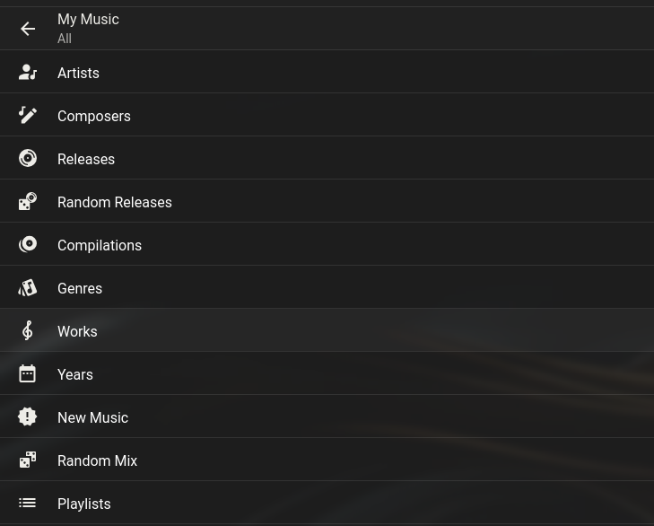
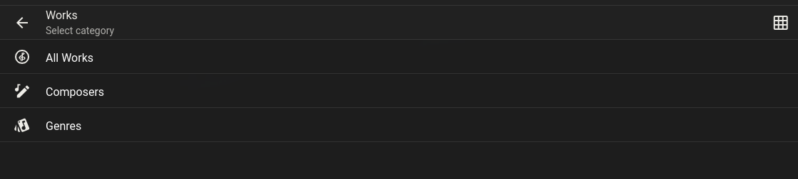
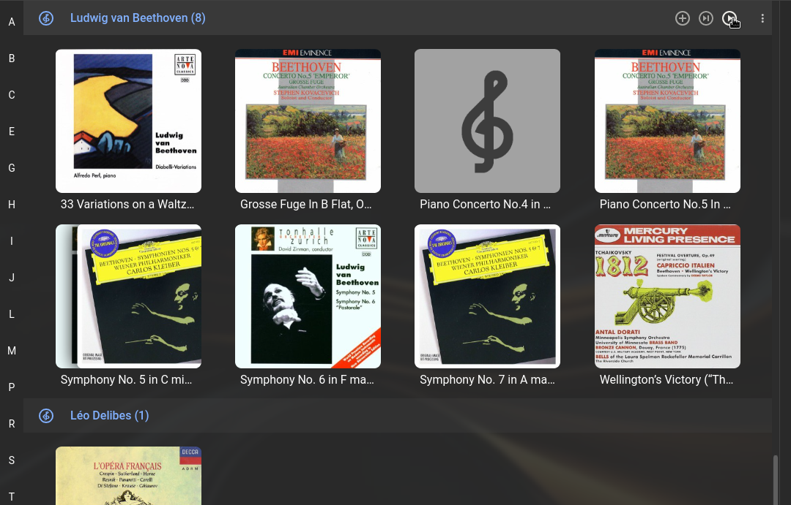
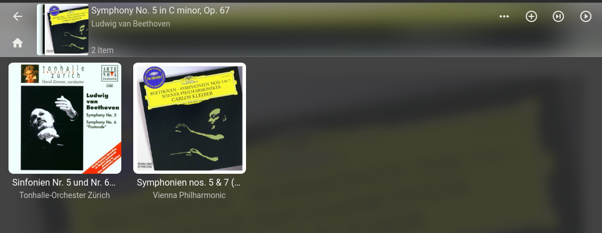
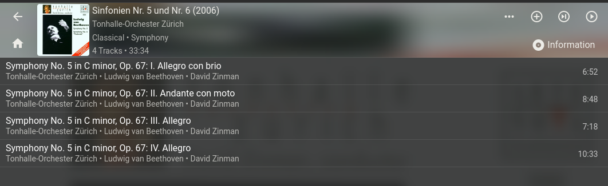
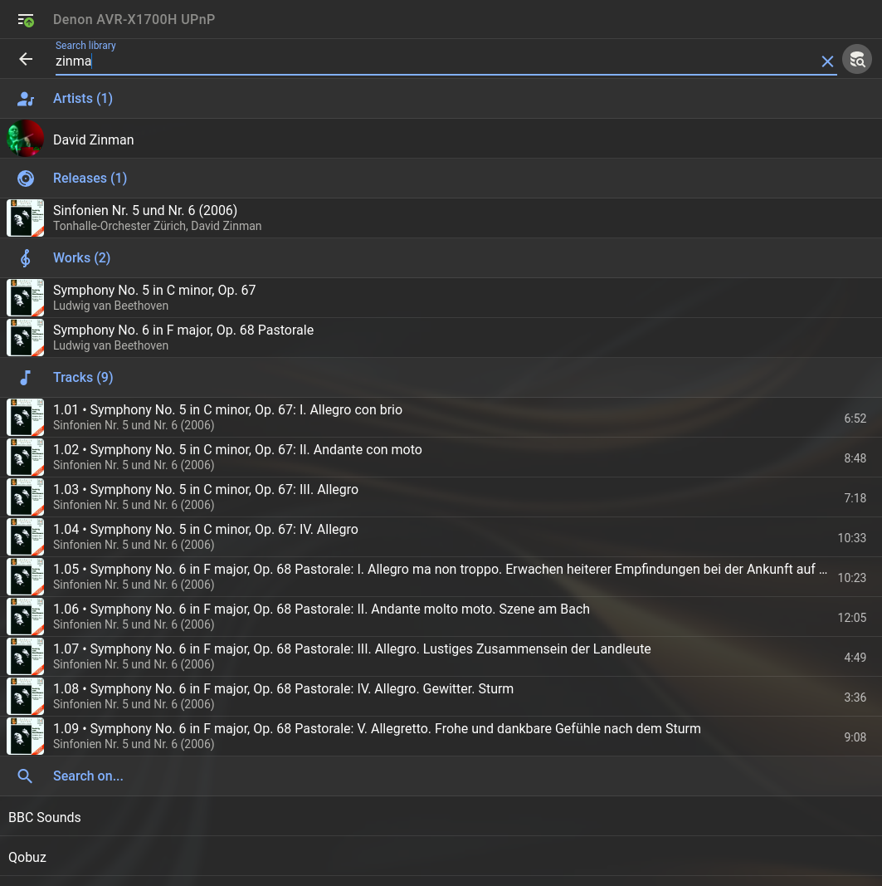
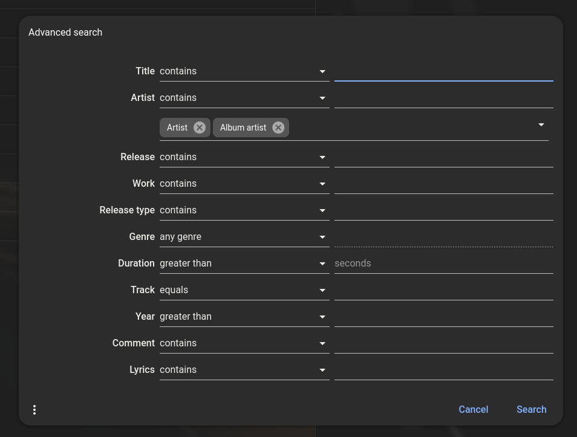

# Beginner's Guide to classical music on LMS

LMS 9.0 offers comprehensive functionality aimed at the classical music listener. It allows you to browse and search for classical works in your music collection, and much more.

## Basic Tagging

First of all, you need to tag your classical music for LMS.

All you need to get started are for your classical tracks to contain tags for Composer and Work:

- Flac or ogg files: the tags you need to add are COMPOSER and WORK
- MP3 files: the tags you need to add are TCOM for Composer and TIT1 for Work. Your tagging software will almost certainly show these tags with the friendly names of Composer and Work. But note that there is some confusion in the MP3 world over the WORK tag. Your tagging software might create a tag other than TIT1 for what is called "Work" in its user interface. If this happens, LMS will not recognise the Work you have tagged. You can view the raw tag names through LMS by browsing to the track via the album and then going to More/More Info/View Tags (after importing to LMS, of course). If the Work does not appear in a TIT1 tag, look for an "iTunes Compatible" (or similar) setting in your tagging software.

Note that WORK should not contain the composer name. LMS uses the Composer and Work together to identify works, so works called, for example, "Symphony No. 9" will be kept separate if the composer is different.

You can also add a COMPOSERSORT tag to ensure that composer names are listed in surname-first sequence:

- Flac or ogg files: the tag name is COMPOSERSORT
- MP3 files: the tag name is TSOC (again, tagging software will hopefully give this a friendly name of Composer Sort)

## Further Tagging Suggestions

The LMS implementation for classical works will work best with other tags set up like this:

- Title can be either the movement name only, eg "I. Allegro" or include the work name, eg  "Symphony No. 1: I. Allegro". Your choice. The movement name alone is all that is needed for LMS.
- Artist should not contain the composer's name. It should be set to either the soloist or soloists (eg "Martha Argerich"), or the Ensemble name (eg "Schubert Quartet"). If neither of these apply, for example a symphony, put in the Orchestra name.
- Conductor should contain the name of the conductor, if any.
- Band should contain the name of the orchestra, if any (yes, this might be a repeat of what you've got in Artist, but that's fine, and LMS really does want at least one Artist for a track).

Note: You may need to compromise on this tagging scheme if your music tags need to make sense on clients/players/servers other than LMS. That's fine, but it may lead to some duplication in LMS library search results.

## Browsing classical music in LMS

!!! note
	The screenshots below are all using Material Skin, which is installed by default in new LMS 9.0 installations.

	If you don't have it, you can install the Material Skin plugin from the "3rd Party Plugins" section in Settings/Manage Plugins. You can then use Material Skin by appending "/material" to the LMS URL address in your browser, or set it as the default in Server/Interface.

	All the functionality exists also in Default Skin, but may look different and not so pretty!

!!! note
	Some of these menus and displays may be slightly different depending on your LMS Server Settings. That's something that deserves its own page, but see the "Support" section below if something seems wrong or doesn't make sense to you.

Once you have tagged your music and done a full rescan of your library in LMS, you can start exploring the new features.

The first thing you will see is a new Works item in the "My Music" menu:

{ align=left }

Selecting this will show you the Works sub-menu:

{ align=left }

Select, for example, "All Works" which will show you all works, in composer groups. Notice that when you have multiple versions of a work on different albums (Beethoven's 5th, here), the image shows a "stack" of album covers. You can, at this point, add, for example, all your Beethoven works to your playlist (this option is available at every level as shown below):

{ align=left }

Select a particular work. You will see here the albums which contain the selected work:

{ align=left }

Select One of the albums. You will see the track listing, restricted to the Work you are browsing:

{ align=left }

## Searching

You can use the live search facility on the Material Skin home page or the My Music list. Start typing search criteria, any combination of artist, composer, work, album, title, etc and results will appear for artists, releases, works and tracks.:

{ align=left }

You can also use the advanced search to search on specific criteria: while the live search entry field is open, click the search icon again, fill in the form and then hit "search". Results will be shown categorised as before:

{ align=left }

## Managing and browsing large collections
to do

## Advanced tagging for operas, ballets, etc
to do

## Advanced tagging for box sets
to do

## Support

In case you encounter some problems, have some questions or suggestions for improvements, please head over to the [forums](https://forums.lyrion.org) for assistance,  specifically [this thread](https://forums.slimdevices.com/forum/user-forums/logitech-media-server/1737175-lyrion-music-server-9-0-0-classical-works-functionality-support)
