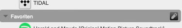
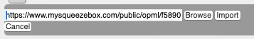

# _This page is obsolete_

# How to Import Favorites from MySqueezebox.com

You can import the existing list of Favorites from MySqueezebox.com into Logitech Media Server. In LMS versions before v8.5.0 the list was automatically linked to from the Favorites list. But it remained on the server. As this server it to go away, you should import the list and store it in Logitech Media Server. Luckily all you need to do this already is there.

## Get the URL for your Favorites

Sign in to [MySqueezebox.com](https://www.mysqueezebox.com/settings/favorites){:target="_blank"} and head over to your Favorites list. At the bottom you'll find a link to an OPML file with your Favorites. Right click the link top copy it.

## Import the list of Favorites in Logitech Media Server

I Logitech Media Server click the pencil button on the Favorites menu item. This will open the list of Favorites in edit mode.

At the bottom you'll see a few buttons. The right most of them is the "Import" button. Click it to get an input field.

Paste the previously copied URL in to that input field. Hit Import.

You should now have all the Favorites from MySqueezebox.com stored in your Logitech Media Server. This works with LMS v8.5.0 and later, too.
