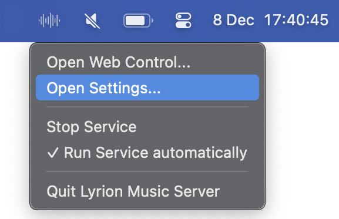

# Getting started on macOS

## Installing Lyrion Music Server for the first time

If you have another version of Lyrion Music Server (or Logitech Media Server) installed already make sure the server is stopped before installing.

After installation you will have a new app in your Mac's Applications folder called "Lyrion Music Server". When you run this, it will insert a menu into your menu bar right-hand side, from which you can start/stop the server. Note that launching the app does not automatically start the server. On this first running you may find various security requests from your Mac system

{ width="288" }

There is an option in the menu to start the server automatically (when the machine boots).

Unlike many server applications, the Lyrion Music Server app is effectively independent of the server – starting the app does not start the server, or vice versa; and stopping the app does not stop the server, and vice versa.

## Updating Lyrion Music Server

Notification of an available update will appear in the server's control UI and in the app's menu. Selecting the app's menu item will mount the .dmg file containing the files and a window showing a brief summary of these instructions. The upgrade can only be completed if neither the server nor the app are running.

The first step is to stop the LMS server – using the menu item in the LMS app. And then you must Quit the LMS app.

At this point the new version can be copied into the Applications folder and once copied, it can be launched. Note that the LMS server will not launch automatically on this restart of the app – use the 'Start Service' menu item.