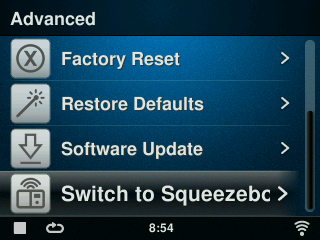
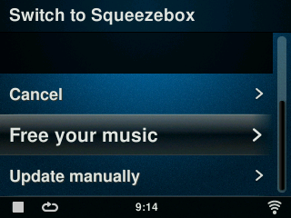
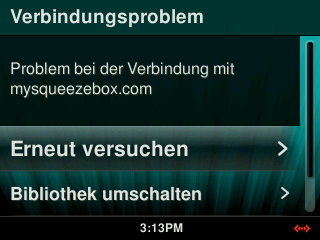

# UE Smart Radio (UESR) nach Squeezebox umwandeln

!!! note
    Bitte beachten Sie, dass UE Smart Radios, die in eine Squeezebox umgewandelt wurden, zwingend [Logitech Media Server (LMS)](../getting-started/index.md)</a>. Installieren Sie dieses Programm, bevor Sie mit der Migration fortfahren.

Um den Prozess zu starten, schalten Sie das Gerät ganz aus, und starten Sie dann neu.

<!-- navigieren Sie zu den "Erweiterten Einstellungen" auf dem Smart Radio. Verwenden Sie Option am Ende des Menüs, um den Prozess zu starten.

-->

Nach dem Neustart des Radios sollte die neue Firmware heruntergeladen werden. Es folgt ein weiterer Neustart, um diese zu installieren und das Gerät zurückzusetzen.

Wählen Sie die bevorzugte Sprache, und folgen Sie den Anweisungen, um das Netzwerk gemäss ihrer Umgebung zu konfigurieren.

Falls Sie gefragt werden, ob Sie ein Konto auf MySqueezebox.com erstellen wollen, so können Sie das überspringen. Sie sollten dann im Hauptmenü die Möglichkeit haben, per "Eigene Musik" auf ihr LMS zuzugreifen.

Falls Sie die Mitteilung "Verbindungsproblem - Problem bei der Verbindung mit mysqueezebox.com" erhalten, dann können nach "Bibliothek umschalten" runter scrollen und sich mit ihrem LMS verbinden.

-->