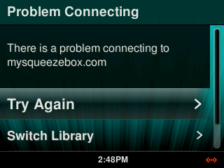

# Migrate from UE Smart Radio (UESR)

([Deutsche Version](migrate-from-uesr-de.md))

!!! note
    Please note that Smart Radios transitioned to Squeezebox Radios will require [Lyrion Music Server](../getting-started/index.md)</a>. Install it before you continue the migration.

To initiate the transition, power down the Radio, and restart it.

<!-- navigate to "Advanced Settings" on your Smart Radio and scroll down to select "Switch to Squeezebox", then "Free your music".

-->

After a restart the Radio should start downloading the new firmware, followed by another reboot and a factory reset:

Choose your preferred language. Then follow the network setup according to your environment.

When asked to create an account on MySqueezebox.com, skip that step and continue without account by pressing and holding the "Back" (:material-arrow-left-bold: ) button on your Radio. You should then get the main menu where you can select "My Music" to connect to your LMS.

If you get an error "Problem Connecting - There is a problem connecting to mysqueezebox.com", you should be able to scroll down to "Switch Library", from where you can connect to your LMS.

