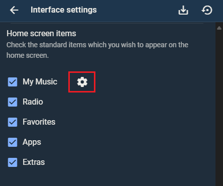

# New Music browsing changes in 9.0
Release 9.0 introduced changes to browsing your music by _New Music_ added to your Lyrion music library and offers and additional new browse menu option for viewing music that was most _Recently Updated_. This guide is intended to provide clarification and further details about this change and answer some frequently asked questions.

## What's changed in 9.0
### New Music browsing
Selecting browse by _New Music_ will now display a list of albums sorted by the actual date that the album was first scanned into your Lyrion library. Technically, it is sorting on the oldest date added from the list tracks for a given album as stored in your persist.db (located in your LMS Prefs directory). Since the persist.db survives a "Clear Library and Rescan All" it is able to maintain a correct history of when music was added to your LMS library based on the timestamp it was first scanned. If for some reason you start with a new persist.db, you will lose the history of when you music was added to Lyrion which is why you should consider this an important file to back up just like you maintain good backups of all of your music files.

!!! note
    As of the latest 9.0.1 release, the first library scan for a new persist.db will populate the Date Added field for each track with the file modified timestamp. All subsequent scans will populate the Date Added with timestamp the file is being scanned. This helps new users or those who must start with a fresh persist.db to start out with a best guess at the correct sort for New Music based on file modified timestamps.

In 9.0 you can also see the Date Added from persist.db in the UI from the context menu by selecting More > More Info.  You will see both Date Added (from persist.db) and Date Modified (from the file modified timestamp as stored in library.db).

### Recently Update Albums browsing
There is an additional browsing option for _Recently Updated Albums_ in 9.0 that will display a list of albums sorted by the file modified timestamp. This is a more accurate description for how the New Music browsing behaved prior to release 9.0. If you prefer to see a list of albums sorted by file modified date like the New Music was previous to 9.0, then you should use _Recently Updated Albums_ browsing menu.

You can add this menu for each player via _Settings > Player > Additional Browse Modes_.

!!! note
    If you do not see _Additional Browse Modes_ as an option then you need to install the Additional Browse Modes plugin via the _Plugin Manager_ under Settings.

<figure markdown="span">
  
</figure>

This setting will apply for all of the UI skins other than Material and all 3rd party apps like iPeng, Squeezer, and Orange Squeeze.

The Material UI has its own settings for displaying Browse Menus under My Music that will apply for all players being controlled by the Material UI regardless of the per player setting above.  You can update this setting by using the hamburger button in the top left to open the Navigation Drawer and selecting Interface Settings near the bottom. Scroll down and click the cog next to My Music.

<figure markdown="span">
    
</figure>

## Frequently Asked Questions

#### Why was the change made when New Music was working well for me?
New Music browsing has actually had a long history of complaints and confusion going back 20 years because unless you carefully managed your file modified dates, simple things like updating tags could move and old album back to the top of the New Music list.  There are plenty of forum posts with questions, confusion and some crazy or clever workarounds.

Over time most users fell into one of two groups. The first group learned to accept or even actually liked that updates to tags would cause an album to move back to the top of the list.  The second group were more New Music purists who would carefully manage their file modified dates by using tagging software that supported an option for preserving file modified dates. But as a result, this meant that a "Clear Library and Rescan All" would have to be run after each change to tags and required careful manual management of backing up those changes too. Now some folks got even more clever with the workarounds by using tools that would update the modified dates (after preserving them) to add just a few seconds so they can Scan for Changes and use automated tools for backup of those changes.

The changes in 9.0 were to correct this long-standing problem by finally having a New Music list that was sorted by when Music was added to your Lyrion library while still maintaining a browse option for those who like a list of Recently Updated Albums sorted by file modified date. The great news here is this eliminates the need for the New Music purist to manage all those workarounds.  But if you prefer the workaround methods that you are used to, you can still continue to do so and use the new [Recently Updated Albums](#recently-update-albums-browsing) browse menu.

#### Why couldn't you just leave New Music as it has been for so long and create a new browse menu for the new thing?
Change is hard when you have become accustomed to something, but can you imagine how confusing it would be to explain this to a new user who did not have your history. New Music needs to be the name for a list Music sorted by when it was added to the library and Recently Updated is the best name that was decided upon for the list sorted by file modified date.

#### Why do I see New Album at the top of both New Music and Recently Updated Albums?
Technically speaking neither of these queries use a means to know if an album existed in the library prior to the date and timestamp they sort by:

- [New Music](#new-music-browsing) is a list of your albums sorted on the date added field in your persist.db which represents when you added the music to your LMS library.
  
- [Recently Updated Albums](#recently-update-albums-browsing) is a list of your albums sorted on the file modified timestamp (as stored in library.db).

So that means the following are all true:

- If you rip a new CD today and run scan for new and changed, that CD will be at the top of both the New Music and Recently Updated lists.
  
- If you modify the tags on an album that has already been scanned in to your library without preserving the modified timestamp, this album will sort to the top of your Recently Updated, but will not change positions on the New Music list after a scan.
  
- If you modify the tags on an album that has already been scanned in to your library and preserve the modified timestamp, this album will stay in the same position on both lists after a Clear & Rescan All.

#### How do I fix my New Music list which looks completely wrong?
You can choose to reset your New Music list to be based on File Modified dates for all of your existing music by starting over with a fresh persist.db. But please understand that this will be a one time reset for just your existing music. All subsequent additions to your music library will be sorted based on the timestamp they were first scanned into your Lytion library and any changes to file modified dates will not be reflected in the New Music list.

!!! note
    Please be aware that starting with a fresh persist.db means you will __lose play history stats (counts and last played date) and ratings__. If you are using the Ratings Light plugin, ratings can be backed up and restored after you reset your persist.db. The same is true for the alternative play history stats if you use the Alternative Play Count plugin.

Steps to reset your persisti.db (_Did you read the Note above first?_):

1. Stop your Lyrion Server.

2. Backup your persist.db (persist.db* from your Prefs directory) and library.db (library.db* from your Cache directory). There may be 3 files for each. You will want to have those backups if you are not happy with the results of this process or did not read the note above.

3. Delete persist.db* from your Prefs directory and library.db* from your Cache directory.
 
4. Upgrade to the latest 9.0.1 if you are not on that release or later.

5. Start Lyrion and it should begin a new scan (if not go ahead and initiate a Clear Library and Rescan All).

#### Why is my New Music list in reverse alphabetical order
You probably started with a fresh persist.db when you upgraded to 9.0. The initial release of 9.0 did not accommodate this situation and as a result you are seeing a list of albums based on the order they were scanned with your last album scanned at the top of the list.  As noted above a change was made in 9.0.1 to accommodate this by loading the file modified date as date added for the first scan of a fresh persist.db. You can follow the steps above for How do I fix my New Music List to upgrade to 9.0.1 and reset your persist.db.

#### Why do I see an old album that has been in my library for years suddenly at the top of my New Music list?
The most likely reasons are you renamed a filename, folder name, or reorganized your files by moving files or folders and the scanner did not recognize them as a matching record in your persist.db.  As a result, it created a new record. Lyrion uniquely identifies each file by a url made up of the complete folder structure and filename and as a backup the scanner will also match based on a MUSICBRAINZ_TRACKID tag. Although the scanner should handle a move of your music at the root level specified in your settings where you define Music Folders, it cannot always easily recognize changes to sub folders without MUSICBRAINZ_TRACKID tags.  In the future, it is recommended that you add MUSICBRAINZ_TRACKID tags prior to remanning or reorganizing your music files (see next question).  

!!! note
    One user in the Forum was able to correct the situation of renaming an artist folder by switching it back and rerunning the scan.  I woudld reccomend giving this a try and then adding MUSICBRAINZ_TRACKID tags before making the change again, but you will need to scan and verify that the tags are in Lyrion before changing the file or folder name again.

#### Do I have to add MUSICBRAINZ tags to all of my music to ensure the New Music list will work?
As a general rule, I would say that adding MUSICBRAINZ_TRACKID tags are a good idea and something you should consider for your music collection moving forward, but you do not have to add MUSCIBRAINZ tags to all of your existing music now unless you compulsively reorganize or rename sub folders constantly for some reason. Assuming these moves are occasional corrections, you could adopt a process of adding the MUSICBRAINZ_TRACKID tags prior to changing names or moving folders. You just need to remember to actually scan those tags into Lyrion and confirm they are there (More > More Info > View Tags) before making the move or renaming files and folders.

