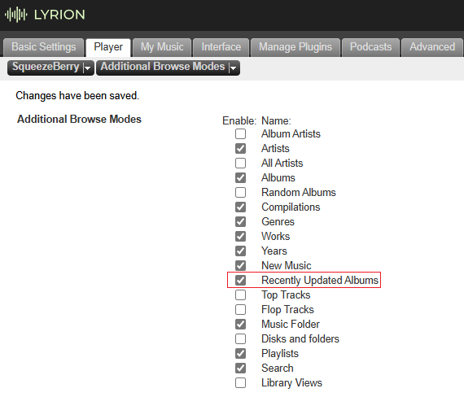

# New Music borwsing changes in 9.0
Release 9.0 intorduced changes to browsing your music by New Music added to your Lryion music library and offers and additional new browse menu option for viewing music that was most recently updated.  This page is intended to provide clarification about this change and answer server frequently asked questions about this change.

## What's changed in 9.0
### New Music browsing
Selecting browse by New Music will display a list of albums sorted by the actual date that the album was first scanned into your Lyrion library. Technically it is sorting on the oldest date added from the list tracks for a given album as stored in your persist.db (located in your LMS Prefs directory). Since the persist.db survives a "Clear Library and Rescan All" it is able to maintain a correct history of when music was added to your LMS library as long as you also maintain a good back up of your persit.db. If you for some reason start with a new persist.db, you will lose the history of when you music was added to Lyrion which is why you shoudl consider this an important file to back up just like you maintain good backups of all of your music files.

!!! note
        As of the latest 9.0.1 release, the first library scan for a new persist.db will populate the Date Added field for each track with the file modified timestamp. All subsequent scans will populate the Date Added with timestamp the file is being scanned. This helps new users or those who have to start with a fresh persist.db to start out with a best guess at the correct sort for New Music based on file modified timestamps.

In 9.0 you can also see the Date Added from persist.db in the UI from the context menu by selecting More > More Info.  You will see both Date Added (from persist.db) and Date Modified (from the file modified timestamp as stored in library.db).

### Recently Update Albums browsing
There is addiotnal borwsing option for Recently Updated Albums in 9.0 that will display a list of albums sorted by the file modified timestamp. This is a more accurate description for how the New Music browsing behaved prior to release 9.0. If you prefer to see a list of albums sorted by file modified date like the New Muisc browsing previous to 9.0, then you shoudl use Recently Updated Albums borwsing menu.

You can add this menu for each player via settings > Player > Additional Browse Modes.

!!! note
        If you do not see Additional Browse Modes as an option then you need to install the Additional Browse Modes plugin via the Plugin Manager.

{ align=left }

This setting will apply for all of the UI skins other than Material and all 3rd party apps like iPeng, Squeezer, and Orange Squeeze.

The Material UI has its own settings for displaying Brownse Menus under My Music that will apply for all players being controled by the Material UI regardless of the per player setting above.  You can update this setting by using the hamberger button in the top left to open the Navigation Drawer and selecting Interface Settings near the bottom. Scroll down and click the cog next to My Music

{ align=left }

## Frequently Asked Questions

#### Why was the change made when New Music was working well for me?
New Music browsing has actually had a long history of complaints and confusion going back 20 years becasue unless you carefully managed your file modified dates simple things like updating tags could move and old album back to the top of the New Music list.  There are plenty of forum posts with questions, confusion and some crazy workarounds.

Over time most users fell into one of two group. The first group learned to accept or even actually liked that updates to tags would casue an album to move back to the top of the list.  The second group were more New Music purist who would carefully manage the file modified dates by using tagging software that supported an option for preserving file modified dates, but this meand that a "Clear Library and Rescan All" would have to be run after each changes to tags and required careful manual management of backing up those changes. And some got even more clever with the workarrouds by using tools that would update the modified dates (after preserving them) by adding just a few seconds so they can Scan for Changes and use automated tools for backup of those changes.

The changes in 9.0 were to correct this long standing problem by finally having a New Music list that was sorted by when Music was added to your Lyrion library while still maintaining a browse option for those who like a list of Recently Updated Albums sorted by file modified date.  

#### Why couldn't you just leave New Music as it has been for so long and create a new browse mode for the new thing?
Change is hard when you have become accustom to something, but can you imagine how confusing it would be to explain to a new user who did not have this history.  New Music needs to be the name for a list Music sorted by when it was added to the loibrary and Recently Updated is the best name that was decided upon for the list sorted by file modified date.

#### Why do I see New Album at the top of both New Music and Recently Updated Albums?
Technically speaking neither of these queries use a means to know if an album existed in the library prior to the date and timestamp they sort by: 
- __New Music__ is a list of your albums sorted on the date added field in your persist.db which represents when you added the music to your LMS library
- __Recently Updated__ is a list of your albums sorted on the file modified timestamp (as stored in library.db)

So that means the following are all true:
- If you rip a new CD today and run scan for new and changed, that CD will be at the top of both the New Music and Recently Updated lists
- If you modify the tags on an album that has already been scanned in to your library without preserving the modified timestamp, this album will sort to the top of your Recently Updated, but will not change positions on the New Music list after a scan
- If you modify the tags on an album that has already been scanned in to your library and preserve the modified timestamp, this album will stay in the same position on both lists after a Clear & Rescan All

#### How do I fix my New Music list which looks completely wrong?
You can reset your New Music list to be based on File Modfied dates for all of your existing music by starting over with a fresh persist.db.  This wil be a one time reset for just your existing music. All subsequent additions to your music library will be sorted based on the timestamp they were first scanned into your Lytion library and any changes to file modified dates will not be relected in the New Music list.

!!! note
        Please be aware that starting with a fresh persist.db means you will lose play history stats (counts and last played date) and ratings. If you are using the Ratings Light plugin, ratings can be backed up and restored after you reset your persist.db. The same is true for the Alternative play history stats if you use the Alternative Play Count plugin.

Steps to reset your persisti.db (Did you read the Note above first?):
1. Stop your Lyrion Server
2. Backup your persist.db (persit.db* from your Prefs directory) and library.db (library.db* from your Cache directory). There may be 3 files for each. You will want to have those backups if you are not happy with the results of this process or did not read the note above.
3. Delete persit.db* from your Prefs directory and library.db* from your Cache directory 
4. Upgrade to the latest 9.0.1 if you are not on that release or later.
5. Start Lyrion and it should begin a new scan (if not go ahead and initiate a Clear Library and Rescan All)

#### Why is my New Music list in reverse alphabetical order
You probably started with a fresh persist.db when you upgraded to 9.0. The initial release of 9.0 did not accomadate this situation and as a result you are seeing a list of albums based on the order they were scanned with the last album scanned at the top of the list.  As noted above a change was made in 9.0.1 to accomadate this by loading the file modified date as date added for the first scan of a fresh persist.db. You can follow the steps above for How do I fix my New Music List to upgrade to 9.0.1 and reset your persist.db.

#### Why do I see an old album that has been in my library for years suddenly at the top of my New Music list?
The most likely reasons are you renamed a filename, folder name, or reorgnaized your files by moving files or folders and the scanner did not recognize them as a mateching record in your persist.db so it created a new record and purged the old that it saw as no longer existing. Lyrion uniquely identifies each file by a url made up of the complete folder structure and filename and as a backup the scanner will also mtach based on a MUSICBRAINZ_TRACKID tag. Although the scanner will also handle a move of your music at the root level specified in your settings where you define Music Folders, it cannot always easily recofnize changes to sub foilders without MUSICBRAINZ_TRACKID tags.  

#### Do I have to add MUSICBRAINZ tags to all of my music to ensure the New Music list will work?
As a general rule, I would say that adding MUSICBRAINZ_TRACKID tags are a good idea and something you should conisder for your music collection moving forward, but you do not have to add MUSCIBRAINZ tags to all of your existing music now unless you compulsively reorganize sub folders constantly for some reason. Assuming these moves are occaisional corrections, you could adopt a process of adding the MUSICBRAINZ_TRACKID tags prior to changing names or moving folders. You just need to remember to actually scan those tags into Lyrion and confirm they are there (More > More Info > View Tags) before making the move or renaming files and folders.
