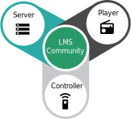

# LMS Community

!!! info
    *This site is under heavy construction while content is being transferred from the old [wiki](https://wiki.slimdevices.com). If you want to help out, please reach out on the [forums](https://forums.slimdevices.com/forum/developer-forums/developers/1662142-move-lms-git-repository-to-new-home).*

Logitech Media Server is a fully open source server software to power a wide range of audio players. With the help of many plugins, Logitech Media Server can stream not only your local music collection, but content from many music services and internet radio stations to your players.

## LMS Ecosystem
Although Squeezeboxes started in 2000 with hard- and software developed by Slim Devices, which became later Logitech, nowadays a wide array of hardware and software solutions exist which make up the LMS ecosystem.

To get a functioning LMS system you need to have three components, namely (1) a server, (2) a controller and (3) one or more music players. These three components can also be supplied by one device, for instance a Raspberry Pi with a touch screen running piCorePlayer.

