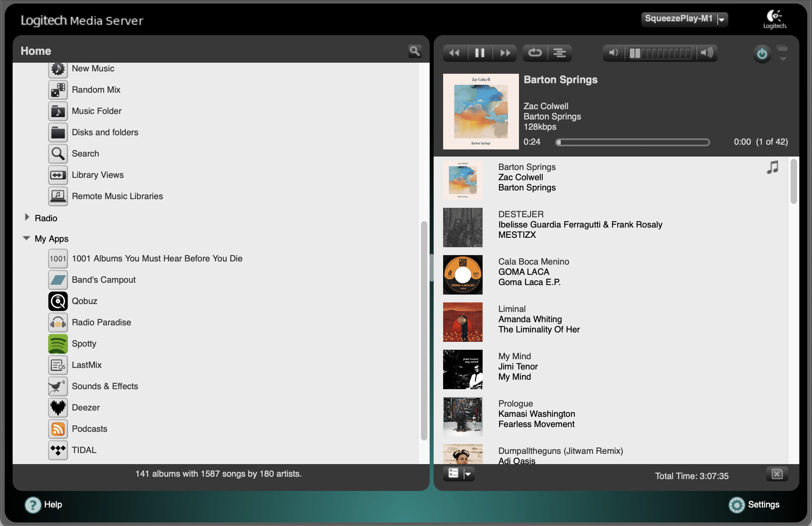

---
hide:
  - navigation
  - toc
layout: default
title: Home
---

# Lyrion Music Server

Lyrion Music Server (formerly Logitech Media Server) is open-source server software which controls a wide range of Squeezebox audio players. Lyrion can stream your local music collection, internet radio stations, and content from many streaming services (with and without subscriptions).

<figure markdown="span">
  { width="600" }
</figure>

## LMS ecosystem

Squeezebox players hit the market in 2000 as hardware and software developed by Slim Devices, later acquired by Logitech. A wide array of hardware and software solutions make up the LMS ecosystem to support Squeezebox devices and OS.

For a LMS system, there will need to be server software running on a controlling computer or device. This provides connections, settings, and customizations to one or more music players. The peer user community is committed to developing the Lyrion software for a wide variety of common and easily obtained devices such as a Windows or Mac computer, tablets and phones, and Raspberry Pi. Because of its scalability, all of these services can be distributed across separate devices to support libraries of hundreds of thousands of tracks and numerous players distributing music throughout an entire house and even across multiple locations.

With Lyrion, you have greater control and customization of your music - how the server works, how you interact with it, and what it looks like.  You have the ability to use the same interface to access your music on almost any device, and to select the appropriate player for every need. There is wide support by the LMS community to add new functionality, fix issues, integrate with other products, and help support users to get the most enjoyment from their music.

If you're new to Lyrion, click on [Getting Started with LMS](getting-started/index.md) to learn more.
