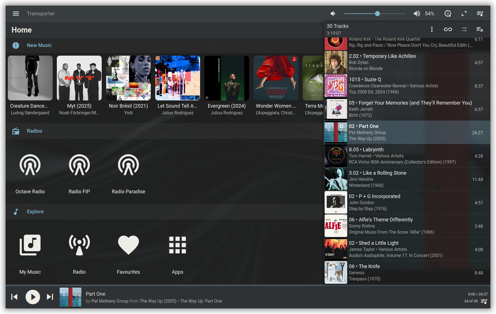
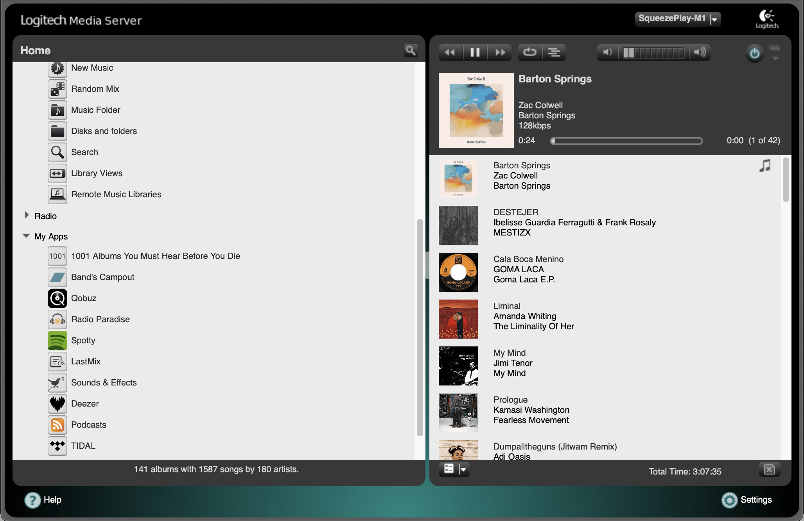
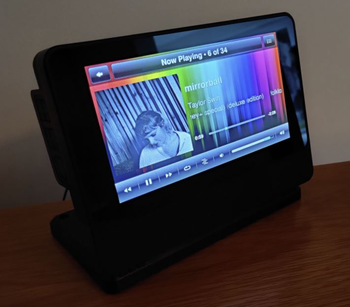

---
hide:
  - navigation
  - toc
layout: default
title: Learn more about Lyrion Music Server
---

# Learn more about Lyrion Music Server

Free your music.

## :material-music: What is Lyrion?

**Lyrion Music Server**, formerly known as Logitech Media Server (LMS) or SlimServer, is a mature, community-driven, open-source audio streaming platform. It acts as a central hub for your music, allowing you to stream your personal local music collection (MP3, FLAC, ALAC, DSD, etc.) alongside major internet streaming services to any room in your house.

Unlike many modern alternatives, Lyrion is completely independent of any single hardware brand or cloud service. It is designed to be lightweight enough to run on a low-power Raspberry Pi, yet powerful enough to manage libraries containing hundreds of thousands of tracks on desktop class hardware or NAS devices.

* Perfect multi-room sync
* Play you own music
* Give life to old devices

<!--<figure markdown="span">
  { width="800" }
</figure>-->

=== "Material skin"
    

=== "Default skin"
    

=== "Jivelite"
    

## :material-star-shooting: Why Choose Lyrion?

Lyrion is the premier choice for music enthusiasts who value control and longevity. While commercial systems often lock you into specific hardware or monthly fees, Lyrion offers:

-   :material-clock-fast:{ .lg .middle } __Lyrion runs everywhere__

    ---

    It runs on almost anything, from a vintage laptop to a high-end NAS, Raspberry Pi, or Docker container.

    [:octicons-arrow-right-24: Getting started](getting-started/index.md)

-   :material-human-greeting-variant:{ .lg .middle } __Community powered__

    ---

    Being open-source means the system is built by people who actually use it. On our forums you will find a welcoming community.

    [:octicons-arrow-right-24: Forums](https://forums.lyrion.org/)
    
-   :material-home-heart:{ .lg .middle } __True ownership__

    ---

    Your data and library remain yours. No mandatory cloud accounts, tracking, or unexpected subscription hikes.

-   :material-rocket-launch:{ .lg .middle } __Future-Proof__

    ---

    You are never at the mercy of a single company's financial decisions or discontinued product lines.

-   :material-puzzle:{ .lg .middle } __Extremely extensible__

    ---

    There are [plugins](plugins/index.md) and [extensions](extensions/applications/index.md) created for every use case imaginable.

    [:octicons-arrow-right-24: Plugins](plugins/directory.md)

-   :material-scale-balance:{ .lg .middle } __Open Source__

    ---

    For over 25 years Lyrion has been open-source! The sourcecode is available on [GitHub](https://github.com/LMS-Community).

    [:octicons-arrow-right-24: License](https://github.com/LMS-Community/slimserver?tab=License-1-ov-file)

## :material-rocket-launch: Lyrion philosophy

Based on the Lyrion philosophy, the system is built on these four pillars:

1.  **Free Software:** Completely open-source and free to use forever.
2.  **Hardware Agnostic:** Although originally designed for [Squeezebox audio players](players-and-controllers/index.md#squeezebox-hardware-discontinued), Lyrion has evolved to be hardware agnostic supporting all of the common standards like AirPlay receivers, Chromecasts, or DIY players (like Squeezelite).
3.  **Massive Scalability:** Effortlessly handles libraries with 100,000+ tracks with lightning-fast indexing and search.
4.  **Perfect Multi-room:** Achieve sample-accurate synchronization across your entire home, regardless of the different hardware brands you use.

## :material-details: Detailed Feature Analysis

### 1. The Power of Plugins
Lyrion’s greatest asset is its community repository. Lyrion allows you to "bolt on" features to suit your specific needs:

*   **Material Skin:** A modern, responsive web interface that transforms the look into a sleek, contemporary app experience.
*   **Streaming services:** All the major streaming services are supported, allowing full library integration for a seamless experience.
*   **Music and Artist Information:** Automatically pulls biographies, lyrics, and high-quality artwork from multiple web sources.
*   **Bridge Plugins:** Use the UPnP/DLNA, Chromecast, and AirPlay bridges to turn almost any smart speaker into a Lyrion player.
*   **DSD support:** Supports DSD64, DSD128, and DSD256. Through the **DSDPlayer plugin**, it handles `.dsf` and `.dff` files. It offers "Native DSD" for supported DACs on Linux/Windows and "DoP" (DSD over PCM) for macOS and hardware-limited bridges. Also, it can transcode DSD streams to players that don't natively support them.

### 2. Interfaces and Customization
Lyrion isn't locked into a single "look." Users can choose their experience:

*   **Default Web UI**: The original, desktop-oriented interface for straightforward library management and player control.
*   **Material Skin:** The gold standard for modern browsers and mobile devices.
*   **Classic Web UI:** Lightweight and functional for older hardware.
*   **JiveLite:** A specialized interface for local displays, perfect for Raspberry Pi touchscreens.

### 3. Metadata and Library Management
Lyrion is famous for its ability to handle complex libraries where others fail.

*   **Classical Music Support:** Proper handling of "Works," "Conductors," and "Composers."
*   **Box Set Management:** Intelligent grouping of multi-disc sets.
*   **On-the-fly Transcoding:** The server can downsample hi-res files in real-time for older devices while maintaining the original quality for your main Hi-Fi system.

## :octicons-move-to-end-24: Getting started

Convinced and want to try it out? Click on [Getting Started with LMS](getting-started/index.md) to learn more.
