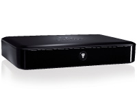
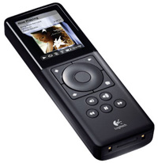

| &nbsp; | **[SLIMP3](SLIMP3.md)** | **[Squeezebox](squeezebox1.md)** | **[Squeezebox2](squeezebox2.md)** | **[Squeezebox v3/Squeezebox Classic](squeezebox-classic.md)** | **[Transporter](transporter.md)** | **[Squeezebox Receiver](squeezebox-receiver.md)** | **[Squeezebox Controller](squeezebox-controller.md)** | **[Squeezebox Boom](squeezebox-boom.md)** | **[Squeezebox Radio](squeezebox-radio.md)** | **[Squeezebox Touch](squeezebox-touch.md)** |
| --- | --- | ---  | --- | --- | --- | --- | --- | --- | --- | --- |
| &nbsp; |  |  |  |  |  |  |  |  |  |  |
| **Nickname** | SLIMP3 | SB1 | SB2 | SB3 | TP or TR | SBR | SBC | SBB or Boom | SB Radio or Radio | SB Touch or Touch |
| **Released** | August 2001 | November 2003 | April 2005 | November 2005 | July 2006 | March 2008 | March 2008 | August 2008 | September 2009 | April 2010 |
| **MSRP at Launch** | $249 | $299 | $299 | $249 | $1999 | $149 ($399 with Controller as Duet) | $299 ($399 with receiver as Duet) | $299 | $199 | $299 |
| **Dimensions** | 8.5"W x 2.5"H x 2"D | 8.5"W x 1.9"H x 4.5"D (216mm x 48mm x 117mm) | Same as Squeezebox | 7.6"W x 3.7"H x 3.1"D (192mm x 93mm x 80mm) including stand | 17"W x 3"H x 12.25"D (433mm x 72mm x 311mm), optional rack mount kit | L: 156mm x W: 106mm (w/o connectors); 112.5mm (w/connectors) x H: 29.25mm | L: 156.2mm x W: 50.8mm x H: 18.8mm | L: 79mm x W: 330mm x H: 127mm | L: 90mm X W: 220mm X H: 130mm | L: 80mm X W: 150mm X H: 100mm including stand |
| **Display** | Noritake 40x2 character VFD | Original SB1: Noritake 40x2 character VFD, later upgraded as SBG: 280x16 pixels VFD, bitmapped graphics, multiple fonts, animation and images brightness control | 320x32 pixel VFD, greyscale, bitmapped graphics, multiple fonts, animation, and images | Same as Squeezebox2, except color is aqua-blue rather than green. (The display itself is green, but while Squeezebox2 uses a gray lens, the Squeezebox v3 lens is slightly purple, resulting in an aqua color.) | Dual 320x32 displays, aqua color | None | 2.4" color LCD, 16bpp, 240x320 portrait | 160x32 pixel VFD, greyscale, bitmapped graphics, multiple fonts, animation, and images | 2.4" color LCD, 16bpp, 240x320 landscape | 4.3" color LCD capacitive touchscreen, 24bpp, 480x272 landscape |
| **CPU** | Microchip PIC16F877 microcontroller | Ubicom IP2K series, 120 MHz | Ubicom IP3K series, 250 MHz | Same as Squeezebox2 | IP3K at 325 MHz | Same as Squeezebox2 | Samsung S3C2412 200 MHz ARM926EJ | Same as Squeezebox2 | Freescale i.MX25 400 MHz ARM926EJ | Freescale i.MX35 533 MHz ARM11 |
| **Ethernet** | Crystal CS8900A 10Mbps embedded Ethernet chip | 10Mbps ethernet interface, RJ-45 twisted pair. Connects to any 10Mbps, 10/100, or 10/100/1000 network. 10/100 switched ethernet is recommended for PCM streaming Auto-detection of full and half-duplex modes. Automatic receive polarity correction. Maximum cable length: 100 meters (328 feet) | True 100Mbps throughput; Shielded CAT5 RJ-45 connector; Connects to any 100Mbps or 10Mbps network; Auto-detects full duplex and half duplex modes; Automatic receive polarity correction; Maximum cable length: 100 meters (328 feet) | Same as Squeezebox2 | Same as Squeezebox2 | Same as Squeezebox2 + Auto Uplink (Auto MDIX) | None | Same as Squeezebox2 + Auto Uplink (Auto MDIX) | Same as Squeezebox2 + Auto Uplink (Auto MDIX) | Same as Squeezebox2 + Auto Uplink (Auto MDIX) |
| **Wireless** | none | 802.11b, external antenna; supports Shared-key WEP only (no WPA) | 802.11g; supports WPA Personal, WPA2-AES and 64/128-bit WEP encryption; high speed PCI interface to radio module; bridging capability allows Ethernet devices to connect to the network through Squeezebox Wireless; internal and external antennas | Same as Squeezebox2, except dual internal antennas rather than internal and external | Same as Squeezebox2, except large dual external antennas | Same as Squeezebox v3 | 802.11g with internal antenna | Same as Squeezebox v3 | Same as Squeezebox v3 | Same as Squeezebox v3 |
| **Decoder** | Micronas MAS3507D | Micronas MAS3539 | Software-based MP3, FLAC, Ogg Vorbis, WMA (except WMA Lossless), AIFF, WAV | Same as Squeezebox2 | Same as Squeezebox2 but with faster CPU | Same as Squeezebox2 | Software-based decoders | Same as Squeezebox2 | Software-based decoders | Software-based decoders |
| **DAC** | Crystal CS4334, 16-bit 44Khz | Micronas MAS3539, 44.1 & 48k | Burr-Brown PCM1748E, 44.1 & 48k | Same as Squeezebox2 | AKM4396, 44.1k, 48k & 96k | Wolfson® 24-bit WM8501, 44.1kHz & 48kHz | Wolfson® WM8750 | Texas Instruments TAS3204 | Texas Instruments TLV320AIC3104 | AKM4420, 44.1k, 48k & 96k |
| **Buffer RAM** | 1Mb (8 seconds at 128Kbps) | 1.8Mb (approx. 14 seconds at 128Kbps) | 25Mb (approx. 200 seconds at 128Kbps) compresessed, plus 28Mb (10 seconds at 44.1 samples/sec) uncompressed | Same as Squeezebox2 | Same as Squeezebox2 | Same as Squeezebox2 | 64MB Mobile SDRAM | Same as Squeezebox2 | 64MB 16-bit bus DDR2 | 128MB 32-bit bus DDR2 |
| **ROM** | Rewritable flash program memory, EEPROM configuration memory | Same | Same | Same | Same | Same | 64MB NAND flash | Same as Squeezebox2 | 128MB NAND flash | 128MB NAND flash |
| **IR** | Standard 40Khz IR receiver | Same |  | Same, plus [Same as Squeezebox2 | Same as Squeezebox2, dedicated IR in/out jacks | None | Built-in IR LED | Standard 40Khz IR receiver | Standard 40Khz IR receiver | Same as Squeezebox2](IRBlasterIR-blasting]] through [GeekHole]%28GeekHole.md%29.md) |
| **IR [Remote](Remote control.md)** | originally shipped with Sony RM-V201 universal remote user-programmed to JVC DVD command set; later shipped with 30 button IR Remote | ? | ? | 30 button IR Remote Included | 31 button IR Remote Included | None (Advanced WiFi Controller included with Duet) | Advanced WiFi Controller | Basic 10 button IR Remote Included | Optional 10 button IR Remote | IR Remote Included |
| **IO Ports** | <ul><li>L+R RCA line-level analog output</li><li>10 Base-T Ethernet port?</li></ul> | ? | ? | ? | ? | ? |  | <ul><li>10/100Base-T Ethernet port</li><li>Line-in via 3.5 mm stereo jack</li><li>Headphone/Subwoofer out via 3.5 mm connector</li></ul> | <ul><li>10/100Base-T Ethernet port</li><li>Line-in via 3.5 mm stereo jack</li><li>3.5 mm stereo headphone jack (side mounted)</li></ul> | ? |
| **[Wake on LAN](Wake on LAN.md) (WOL)** | No | No | Player can wake [SlimServer](SlimServer.md) | Same as Squeezebox2 | Same as Squeezebox2 | N/A | Yes | Yes | Yes | Yes |
| **Power supply** | 5V DC, 1600mA power supply, player uses 700ma (max) | 5V DC, regulated Center positive, sleeve ground Connector: 2.5mm ID, 5.5mm OD, 11mm long Min supply rating: 1000mA. Switching power supply included. Input voltage range and plug style specific to shipping destination. | Same as Squeezebox | Same as Squeezebox2 | Built-in super-linear power supplies, auto ranging 100-240VAC | 9V DC, regulated, center positive, sleeve ground. Connector: 1.05mm ID, 3.5mm OD, 7mm long. Min supply rating: 550mA | 1250mA Li-Ion battery, 2A switching power supply, wired charging station | 12V DC, 2500mA power supply | 18V DC, 1A, optional battery pack available | 5V DC, 3A |
| **Protocols** | DHCP, ARP, IP, ICMP, UDP, Support for subnets/gateways (see documentation section on WANs), UDP-based [SlimProto](../reference/slimproto.md) | Same, plus TCP-based [SlimProto](../reference/slimproto.md) and audio streaming | Same, plus direct HTTP audio streaming and direct connection to [SqueezeNetwork](SqueezeNetwork.md). Will automatically reconnect to SlimServer/SqueezeCenter. | Same as Squeezebox2 | Same as Squeezebox2 | Same as Squeezebox2 | TCP, UDP, ARP, ICMP, HTTP, DNS, DHCP, Comet | Same as Squeezebox2 | TCP, UDP, ARP, ICMP, HTTP, DNS, DHCP, Comet | TCP, UDP, ARP, ICMP, HTTP, DNS, DHCP, Comet |
| **Latest Firmware** | 2.3 | 40 | 137 | 137 | 87 | 77 | SqueezeOS 7.7.0 (Build r9546) | 57 | SqueezeOS 7.7.0 (Build r9546) | SqueezeOS 7.7.0 (Build r9550) |
| **Compatible Server Software Version** | All | 5.0+ (text version), 5.3.0+ (graphic display version) | 6.0+ | 6.0+ | 6.5.0+ | 7.0+ | 7.0+ | 7.2+ | 7.4+ | 7.5+ |
