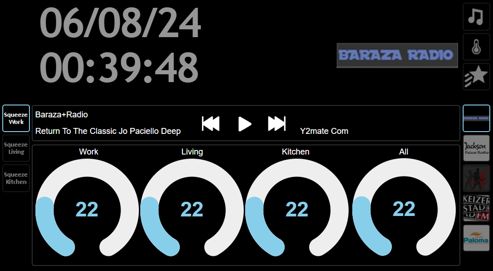

# ioBroker

ioBroker is a free software solution developed in JavaScript that connects building automation components from a wide range of providers in a manufacturer- and protocol-neutral platform. It emerged from the CCU.IO project in 2014.

Numerous so-called adapters are provided to support a wide range of home automation systems.

<figure markdown="span">
  { width="400" }
  <figcaption>Screenshot of the admin interface</figcaption>
</figure>

The squeezeboxrpc plugin for iobroker allows almost complete control of the LMS.

## Features

- most of the data provided by the LMS service is available in the adapter
- detailed information about player status, song title, artist, album, cover, playlist
- many controls for play, pause, stop, fast forward, rewind, repeat, shuffle, play favorites, jump to time (absolute and relative), jump to playlist index (absolute and relative), power on/off and preset buttons
- all favorites and all sublevels from the server
- many widgets for the iobroker-vis component are included to create your own control interfaces (select player, select favorites, manage sync groups, buttons for play/pause, fast forward, rewind, repeat mode and shuffle mode selection)

<figure markdown="span">
  { width="400" }
  <figcaption>Screenshot of a possible design</figcaption>
</figure>

## Installation

The plugin is installed via the administration interface of the iobroker

## Troubleshooting

In case you encounter some problems please head over to the [ioBroker forums](https://forum.iobroker.net/) for assistance or create an issue in the [GitHub](https://github.com/oweitman/ioBroker.squeezeboxrpc) repository.
