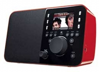

# Squeezebox Radio

<figure markdown="span">
  { width="300" }
</figure>

Squeezebox Radio, released in September 2009, is the now defunct Squeezebox Boom's little brother, and the first full color, Squeezeplay/Linux based Squeezebox. The Radio uses the same acoustic platform as the award winning Squeezebox Boom, and uses an updated version of SqueezeOS, the software from Squeezebox Controller.

Squeezebox Radio includes front panel controls, auxiliary line-in, headphone outputs, and front panel controls. Its host processor is a 400 MHz ARM9E-JS, with 64MB of RAM and 128MB of flash memory.

The Radio has a two-way, bi-amplified mono speaker (as opposed to a stereo speaker) -- this provides the best sound quality of any device its size. Much of the acoustical treatment is the same as on the Squeezebox Boom, details of which can be in [this white paper](assets/Logitech_Squeezebox_Boom_Audio_Design.pdf). Using Lyrion Music Server, two Squeezebox Radios can be synchronized to act as one stereo player.

An accessory pack consisting of a battery and an infrared remote control is optional. 

## UE Smart Radio

Some SB Radios have been "upgraded" to UE Smart Radio. Follow [this guide](../getting-started/migrate-from-uesr.md) if you want to revert to Squeezebox.
