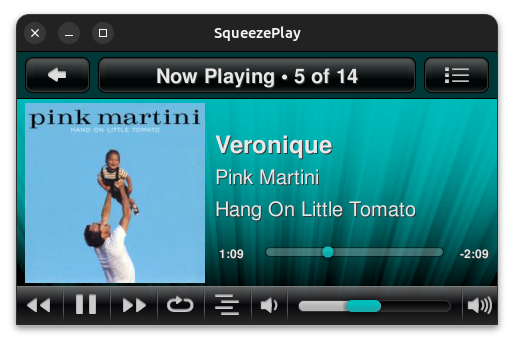

# SqueezePlay

<figure markdown="span">
  { width="400" }
</figure>

SqueezePlay is the desktop version of the Jive/Squeezebox Controller software. It provides an audio player with roughly the same look and feel as Squeezebox user interfaces, for browsing and playing music and internet streams on your personal computer. It's a replacement for [SoftSqueeze](softsqueeze.md) and based on the SqueezeOS software platform. 

If you are looking for a practical all-in-one solution for playback and to control your music from your desktop, SqueezePlay is your best pick. If you are looking for more advanced playback capabilities and more customization for the control application, please look into the [Jivelite](jivelite.md)+[Squeezelite](squeezelite.md) combination.

Currently SqueezePlay is maintained by Ralph Irving and the source code can be found of :octicons-mark-github-16: [Github](https://github.com/ralph-irving/squeezeplay).

## Downloads

SqueezePlay runs on macOS, Windows, Linux and Solaris desktop operating systems. Current builds can be downloaded from :simple-sourceforge: [Sourceforge](https://sourceforge.net/projects/lmsclients/files/squeezeplay/).

## Main features

- High resolution playback capabilities (up to 192 kHz, 24-bits)
- Synchronizes with other Squeezebox players
- Intuitive interface for controlling music playback
- Same interface as Squeezebox Touch, Squeezebox Controller and Squeezebox Radio

## Keyboard shortcuts

```
Go					RIGHT, RETURN, mouse middle button
Back				LEFT, ESC, (todo - mouse right button), BACKSPACE
Scroll up			UP, mouse wheel
Scroll down			DOWN, mouse wheel
Home				h, HOME
Up					i
Down				k
Left				j
Right				l
Play				x p, mouse left button, (Media Key PLAY - Windows, Linux)
Play (hold)			P
Play next			W
Pause				c space, (Media Key PAUSE - Windows, Linux)
Add					a, (Keypad +)
Add  (hold)			A
Rew					z, <, (Media Key REW - Windows, Linux)
Rew  (hold)			Z
Fwd					b, >, (Media Key FWD - Windows, Linux)
Fwd  (hold)			B
Volume up			+, =, (Media Key VOLUP)
Volume down			-, (Media Key VOLDOWN)
Screenshot			S
Disconnect Player	D
Search				/
[					Now Playing
]					Now Playing Playlist
,					Shuffle Toggle
.					Repeat Toggle
;					Music Library
:					Favorites
Play Favorite 0-9	0-9
```

## Troubleshooting

In case you encounter some problems please head over to the [forums](https://forums.slimdevices.com/forum/user-forums/general-discussion/93838-squeezeplay-for-windows-with-asio-directsound-wasapi-and-wdmks-device-support) for assistance. 
