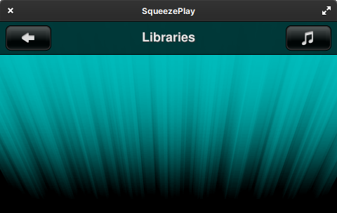

# SqueezePlay

<figure markdown="span">
  { width="400" }
</figure>

SqueezePlay is the desktop version of the Jive/Squeezebox Controller software. It provides an audio player with roughly the same look and feel as the Squeezebox user interfaces, for browsing, playing music and internet streams on your personal computer. It's a replacement for [SoftSqueeze](softsqueeze.md) and based on the SqueezeOS software platform.

If you are looking for a practical all-in-one solution for playback and to control your music from your desktop, SqueezePlay is your best pick. If you are looking for more advanced playback capabilities and more customization for the control application, please look into the [Jivelite](jivelite.md)+[Squeezelite](squeezelite.md) combination.

Currently SqueezePlay is maintained by Ralph Irving and the source code can be found at :octicons-mark-github-16: [Github](https://github.com/ralph-irving/squeezeplay).

## Downloads

SqueezePlay runs on macOS, Windows, Linux and Solaris desktop operating systems. Current builds can be downloaded from :simple-sourceforge: [Sourceforge](https://sourceforge.net/projects/lmsclients/files/squeezeplay/).

## Main features

- High resolution playback capabilities (up to 192 kHz, 24-bits)
- Synchronizes with other Squeezebox players
- Intuitive interface for controlling music playback
- Same interface as Squeezebox Touch, Squeezebox Controller and Squeezebox Radio

## Keyboard shortcuts

```
Go					RIGHT, RETURN, mouse middle button
Back				LEFT, ESC, (todo - mouse right button), BACKSPACE
Scroll up			UP, mouse wheel
Scroll down			DOWN, mouse wheel
Home				h, HOME
Up					i
Down				k
Left				j
Right				l
Play				x p, mouse left button, (Media Key PLAY - Windows, Linux)
Play (hold)			P
Play next			W
Pause				c space, (Media Key PAUSE - Windows, Linux)
Add					a, (Keypad +)
Add  (hold)			A
Rew					z, <, (Media Key REW - Windows, Linux)
Rew  (hold)			Z
Fwd					b, >, (Media Key FWD - Windows, Linux)
Fwd  (hold)			B
Volume up			+, =, (Media Key VOLUP)
Volume down			-, (Media Key VOLDOWN)
Screenshot			S
Disconnect Player	D
Search				/
[					Now Playing
]					Now Playing Playlist
,					Shuffle Toggle
.					Repeat Toggle
;					Music Library
:					Favorites
Play Favorite 0-9	0-9
```

## Troubleshooting

_Some_ issues with SqueezePlay can be resolved by renaming (or removing) the `userpath` directory. Keep in mind that your installed apps and any menu customizations are stored in `userpath`, so it's best to make a backup before tinkering with it!

For the various supported platforms, `userpath` is located in:

* `%USERPROFILE%\AppData\Roaming\SqueezePlay` for Windows
* `~/Library/Preferences/SqueezePlay` for macOS
* and `~/.squeezeplay` for other Unix/Linux

Removing/renaming this directory allows you to start with a fresh configuration, and go through the first-launch setup steps again.

### No libraries showing up during initial setup

SqueezePlay has a known issue[^fn1] on several platforms where it fails to receive the broadcast packets from instances of Lyrion Media Server on your local network, when the host running SqueezePlay has multiple network interfaces. This can leave you stuck at the "Libraries" screen during initial setup, with no obvious way to proceed, as shown in the screenshot below.

<figure markdown="span">
  
</figure>

If it isn't possible to disable the other network interfaces during initial setup, try this workaround[^fn2]:

1. press <kbd>D</kbd> (upper-case "D") to get to the top-level menu
2. choose _Settings_ → _Advanced_ (off the bottom of the default screen, so use arrow keys to scroll)
3. choose _Networking_ → _Remote Libraries_
4. enter the IP address of the desired LMS instance

In case you encounter other issues, please head over to the [forums](https://forums.lyrion.org/forum/user-forums/general-discussion/93838-squeezeplay-for-windows-with-asio-directsound-wasapi-and-wdmks-device-support) for assistance.

[^fn1]: [https://forums.lyrion.org/forum/user-forums/general-discussion/1732269-squeezeplay-setup-8-4-1r1474-exe-windows-not-finding-server?p=1732388#post1732388](https://forums.lyrion.org/forum/user-forums/general-discussion/1732269-squeezeplay-setup-8-4-1r1474-exe-windows-not-finding-server?p=1732388#post1732388)
[^fn2]: [https://forums.lyrion.org/forum/user-forums/general-discussion/1732269-squeezeplay-setup-8-4-1r1474-exe-windows-not-finding-server?p=1745250#post1745250](https://forums.lyrion.org/forum/user-forums/general-discussion/1732269-squeezeplay-setup-8-4-1r1474-exe-windows-not-finding-server?p=1745250#post1745250)
