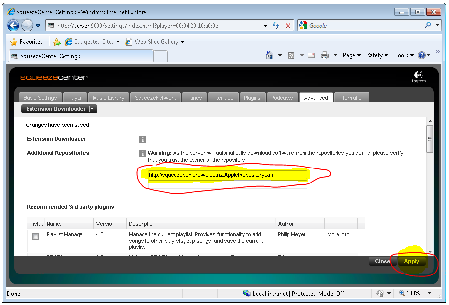

# Installing SqueezePlay Applets

You may download and install these applets on your Squeezebox Controller to add extra capabilities or fun additions such as games. You can also read a guide to developing new applets.

Currenty there are two ways to install an applet on your Squeezebox Controller:

* via applet installer (preferred)
* manual installation.

For the applet installer to work, applet developers have to provide a repository-URL pointing to their applets. Many older applets unfortunately are not listed in a repository, that's why manual installation often is the only way to get an applet on the controller.

## Applet Installer

Installing an applet is a two step process.

* You need to have a 'repository-URL' which points to a repository XML file. See [Repositories](repository-dev.md) for some existing respositories you can use. _You need to configure this on your Lyrion Music Server_.

* On your SqueezeBox-Server (http://ServerName:9000) navigate to the settings-screen.
* Select the 'Manage Plugins' tab
* In the text input area next to 'Additional Repositories', put the repository-URL of your applet(s) and click 'Apply'. If you have more than repository URL add the first and click apply, and then a new text input area will be shown. Continue adding respository urls as required.

You need to configure this on your Squeezebox-Controller or SqueezePlay!

* Navigate to Settings -> Advanced -> Applet Installer.
* In this menu you should see each of the applets which Squeezebox-Server has installed together with its version.
* Select which applets you wish to install on the remote and then select Install. This will cause the applets to be downloaded and installed. After they are installed the SqueezeBox Controller will restart (on the SqueezePlay you will need to shut it down and restart it manually).
* Once restarted the new applets should be available, normally under the Extras menu (but it depends on the applet)

    If you can't see this menu you might have to activate it. Just go under 'Settings->Home Menu' where you will be able to activate the 'Extras'-menu

## Manual installation

If you want to install an applet manually you can do the following:

* Enable ssh access on the SBC. On the SqueezeBox Controller go to the Settings->Advanced->Remote Login and checking "Enable SSH". When you enable SSH you will be given a password (my default was 1234) and it will also give you the IP Address of the controller. Write both down.

!!! note

    SSH is "secure shell" and it just a way of connecting remotely to computers and other devices.

    SCP is secure copy, which is a way of uploading/downloading files to computers and other devices.

* download WinSCP or some other SCP client - see this example of connecting to the SBC with WINSCP
* connect to the SCP and login as root with the password it gave you when you enabled ssh
* extract the zip file for the applet on your PC
* look in the extracted files and you will find another zip file
* extract that zip file
* use SCP to copy the folders from the second zip file into /usr/share/jive/applets on the SBC
* restart Squeezeplay

Normally the applet will show up in the Extras menu but it can appear in the main menu as well.
Source: [http://forums.lyrion.org/showthread.php?t=47798](http://forums.lyrion.org/showthread.php?t=47798)
