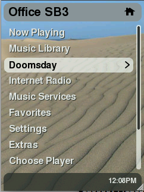
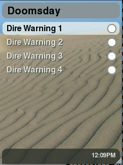
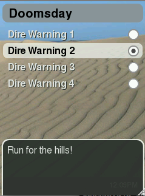

# SqueezePlay Applet Developing Guide

## Introduction

This document serves as a starting point for those wanting to develop Lua applets for SqueezePlay (and, by extention, the SqueezeboxController).

It is not intended as a Lua programming guide, which can be found [online here](https://www.lua.org/manual/5.1/index.html#contents).

First things first, check yourself out a copy of SqueezePlay. Once you have a working desktop version of SqueezePlay, beginning development will be much easier.

Please also not that the sourcecode provided here was written for the 7.3 firmware. 7.4 changes some variables names when creating menus or popup-windows. Please study the 'Test'-applet provided with SqueezePlay so you can adapt the needed changes.

## Applet Files

The two main files in any SqueezePlay applet are the Meta and Applet files. The naming convention is AppletNameMeta.lua and AppletNameApplet.lua, respectively. You can also have any number of helper files, notably a strings.txt file to translate string tokens into other languages, and a settings.lua file that contains saved configuration information that your applet might need to store.

### Meta file

The Meta file registers your applet to SqueezePlay for use. It is required for your applet to load correctly. Typically, a registerApplet function lets SqueezePlay add a menu item(s) for your applet, and an applet function to run when drilling into that menu item.

#### Example: DoomsdayMeta.lua

```lua
 local oo            = require("loop.simple")
 local AppletMeta    = require("jive.AppletMeta")
 local appletManager = appletManager
 local jiveMain      = jiveMain

 module(...)
 oo.class(_M, AppletMeta)

 function jiveVersion(meta)
       return 1, 1
 end

 function defaultSettings(meta)
       return {
               currentSetting = 0,
       }
 end

 function registerApplet(meta)
       jiveMain:addItem(meta:menuItem('doomsdayApplet', 'home', "DOOMSDAY", function(applet, ...) applet:menu(...) end, 20))
 end
 ```

#### Dissecting DoomsdayMeta.lua

Variable Declaration:

```lua
 local oo            = require("loop.simple")
 local AppletMeta    = require("jive.AppletMeta")
 local appletManager = appletManager
 local jiveMain      = jiveMain
```

In SqueezePlay it is necessary to explicitly define all functions and classes you wish to use in your applet. This is done through require() statements, and in some cases, the pulling in of global variables into local space. Note: this also needs to be done for Lua internal functions like tostring, setmetatable, etc.

So, in this example, we are defining four things: `oo`, `AppletMeta`, `appletManager`, and `jiveMain`.

#### Module and Class Declaration

Next we define the type of file we are constructing:

```lua
 module(...)
 oo.class(_M, AppletMeta)
```

In essence what these two lines say are "this is a meta file, and we're going to define all variables to be used locally" or "new class (AppleNameMeta) inheriting from AppetMeta". Note we had to define AppletMeta above by requiring our superclass jive.AppletMeta.

#### Meta File Functions

Now on to the meta functions:

```lua
 function jiveVersion(meta)
       return 1, 1
 end
```

sets the valid versions (min and max) that this applet will run under. In this example, min and max are set to 1, which means that the jiveVersion has to be set to 1 for this applet to load. Note: this number does not correspond to the external SqueezePlay version number, e.g., 7.0.1

Default settings are important to define if a settings.lua file is going to be used:

```lua
 function defaultSettings(meta)
       return {
               currentSetting = 0,
       }
 end
```

settings.lua files are created dynamically by an applet, so it doesn't exist when first using the applet. This is where you define default settings so SqueezePlay doesn't balk when trying to getSettings()

Finally we register our applet:

```lua
 function registerApplet(meta)
       jiveMain:addItem(meta:menuItem('doomsdayApplet', 'home', "DOOMSDAY", function(applet, ...) applet:menu(...) end, 20))
 end
```

This line is a bit complicated with arguments. What we are doing here is adding a menu item to the "homeMenu" area of Squeezeplay, which are those top-level menus that are managed by jive/ui/HomeMenu.lua. The menuItem() function general form is

```lua
 menuItem(id, node, token, callback, [weight])
```

* id => unique key that HomeMenu uses to reference this item
* node => HomeMenu node to add this item to. 'home' places the item in the top-most menu. Other options include 'myMusic', 'extras', 'settings', and 'advancedSettings'.
* token => string token to be used for displaying the menu item
* callback => function to callback when this menu item is drilled into. Typically in a meta file you reference the corresponding applet file function to execute.
* weight => an optional parameter given to place the item higher or lower in the list. Default weight of unweighted items is 5, and by convention items sent from SqueezeCenter (e.g., Music Library) have weights between 10 and 100.

#### The Fruits of Our Labor

The Meta file has now provided a HomeMenu item for the applet:



### Applet file

The Applet file is the main part of your applet. It typically does the majority of the "heavy lifting" for whatever it is you want to do.

#### Example: DoomsdayApplet.lua

```lua
 --[[
 =head1 NAME

 applets.Doomsday.DoomsdayApplet - Doomsday Applet

 =head1 DESCRIPTION

 This applet was created solely for the purpose of a demonstration

 =head1 FUNCTIONS

 Applet related methods are described in L<jive.Applet>.

 =cut
 --]]


 -- stuff we use
 local tostring = tostring
 local oo                     = require("loop.simple")
 local string                 = require("string")

 local Applet                 = require("jive.Applet")
 local RadioButton            = require("jive.ui.RadioButton")
 local RadioGroup             = require("jive.ui.RadioGroup")
 local Window                 = require("jive.ui.Window")
 local Popup                  = require("jive.ui.Popup")
 local Textarea               = require('jive.ui.Textarea')
 local SimpleMenu             = require("jive.ui.SimpleMenu")

 module(...)
 oo.class(_M, Applet)

 function menu(self, menuItem)

       log:info("menu")
       local group = RadioGroup()
       local currentSetting = self:getSettings().currentSetting

       -- create a SimpleMenu object with selections to be created
       local menu = SimpleMenu("menu", {
               -- first menu item
               {
                       -- text for the menu item
                       text = self:string("DOOMSDAY_OPTION1"),
                       -- add a radiobutton with a callback function to be used when selected
                       icon = RadioButton(
                               -- skin style of radio button (defined in DefaultSkin)
                               "radio",
                               -- group to attach button
                               group,
                               -- callback function
                               function()
                                       log:info("radio button 1 selected")
                                       -- show the warning
                                       self:warnMasses('DOOMSDAY_MESSAGE1')
                                       -- store the setting to settings.lua
                                       self:getSettings()['currentSetting'] = 1
                                       self:storeSettings()
                               end,
                               -- fill the radio button if this is the currentSetting
                               (currentSetting == 1)
                       ),
               },
               {
                       text = self:string("DOOMSDAY_OPTION2"),
                       icon = RadioButton(
                               "radio",
                               group,
                               function()
                                       log:info("radio button 2 selected")
                                       self:warnMasses('DOOMSDAY_MESSAGE2')
                                       self:getSettings()['currentSetting'] = 2
                                       self:storeSettings()
                               end,
                               (currentSetting == 2)
                       ),
               },
               {
                       text = self:string("DOOMSDAY_OPTION3"),
                       icon = RadioButton(
                               "radio",
                               group,
                               function()
                                       log:info("radio button 3 selected")
                                       self:warnMasses('DOOMSDAY_MESSAGE3')
                                       self:getSettings()['currentSetting'] = 3
                                       self:storeSettings()
                               end,
                               (currentSetting == 3)
                       ),
               },
               {
                       text = self:string("DOOMSDAY_OPTION4"),
                       icon = RadioButton(
                               "radio",
                               group,
                               function()
                                       log:info("radio button 4 selected")
                                       self:warnMasses('DOOMSDAY_MESSAGE4')
                                       self:getSettings()['currentSetting'] = 4
                                       self:storeSettings()
                               end,
                               (currentSetting == 4)
                       ),
               },
       })

       -- create a window object
       local window = Window("window", self:string("DOOMSDAY"))

       -- add the SimpleMenu to the window
       window:addWidget(menu)

       -- show the window
       window:show()
 end

 function warnMasses(self, warning)
       log:info(self:string(warning))

       -- create a Popup object, using already established 'toast_popup_text' skin style
       local doomsday = Popup('toast_popup_text')

       -- add message to popup
       local doomsdayMessage = Group("group", {
                       text = Textarea('toast_popup_textarea',self:string(warning)),
             })
       doomsday:addWidget(doomsdayMessage)

       -- display the message for 3 seconds
       doomsday:showBriefly(3000, nil, Window.transitionPushPopupUp, Window.transitionPushPopupDown)
 end
```

#### Dissecting DoomsdayApplet.lua
Embedded documentation

```lua
 --[[
 =head1 NAME

 applets.Doomsday.DoomsdayApplet - Doomsday Applet

 =head1 DESCRIPTION

 This applet was created solely for the purpose of a demonstration

 =head1 FUNCTIONS

 Applet related methods are described in L<jive.Applet>.

 =cut
 --]]
```

The section at the top of the file here that's within a Lua comment section `--[[ comments... ]]---` is in standard POD format for documentation, which [Wikipedia has a nice write-up on](http://en.wikipedia.org/wiki/Plain_Old_Documentation).

Variable Declaration

As we did in the meta file, it is necessary to declare everything external that's going to be used in the file.

```lua
 -- stuff we use
 local tostring = tostring
 local oo                     = require("loop.simple")
 local string                 = require("string")

 local Applet                 = require("jive.Applet")
 local RadioButton            = require("jive.ui.RadioButton")
 local RadioGroup             = require("jive.ui.RadioGroup")
 local Window                 = require("jive.ui.Window")
 local Popup                  = require("jive.ui.Popup")
 local Textarea               = require('jive.ui.Textarea')
 local SimpleMenu             = require("jive.ui.SimpleMenu")
 local Group                  = require("jive.ui.Group")
```

In the case of the applet, we are going to be accessing a bunch of ui widgets (`RadioButton`, `RadioGroup`, `Window`, `Popup`, `Textarea`, `SimpleMenu`, `RadioGroup`).

Module and Class Declaration

```lua
 module(...)
 oo.class(_M, Applet)
```

This is no different from the Meta file, other than declaring that this is an Applet class, not Meta. By using these required lines, you are stating that all variables, including Lua internal functions, need to be declared explicitly above these lines (e.g., see previous section).

Applet Functions

There are two functions here, `menu()` and `warnMasses()`. `menu()` as you may recall is the function defined in the Meta file as the one to be called when the "Doomsday" menu item is selected. This function creates a menu via the `jive.ui.SimpleMenu` widget, and creates four items that can be selected for a special Doomsday popup warning, which is driven by the `radioButton` callback to `warnMasses()`.

(Screenshots below)

Additionally, when a radio button is selected that setting is stored in settings.lua and subsequent returns to this menu will fill in the last selected item in the menu.

Note the first row in the menu function

```lua
 log:info("menu")
```

This uses a "log" variable that hasn't been declared in the declaration section. The reason this works is because SqueezePlay automatically declares a "log" variable for all registered applets. It's declared with the identity "applet.Doomsday" where "Doomsday" is the name of the applet. You can enable different log levels through the SqueezePlay menu Settings/Advanced/Logging.

The functions are commented for clarity within the code:

```lua
 function menu(self, menuItem)

       log:info("menu")
       local group = RadioGroup()
       local currentSetting = self:getSettings().currentSetting

       -- create a SimpleMenu object with selections to be created
       local menu = SimpleMenu("menu", {
               -- first menu item
               {
                       -- text for the menu item
                       text = self:string("DOOMSDAY_OPTION1"),
                       -- add a radiobutton with a callback function to be used when selected
                       icon = RadioButton(
                               -- skin style of radio button (defined in DefaultSkin)
                               "radio",
                               -- group to attach button
                               group,
                               -- callback function
                               function()
                                       log:info("radio button 1 selected")
                                       -- show the warning
                                       self:warnMasses('DOOMSDAY_MESSAGE1')
                                       -- store the setting to settings.lua
                                       self:getSettings()['currentSetting'] = 1
                                       self:storeSettings()
                               end,
                               -- fill the radio button if this is the currentSetting
                               (currentSetting == 1)
                       ),
               },
               {
                       text = self:string("DOOMSDAY_OPTION2"),
                       icon = RadioButton(
                               "radio",
                               group,
                               function()
                                       log:info("radio button 2 selected")
                                       self:warnMasses('DOOMSDAY_MESSAGE2')
                                       self:getSettings()['currentSetting'] = 2
                                       self:storeSettings()
                               end,
                               (currentSetting == 2)
                       ),
               },
               {
                       text = self:string("DOOMSDAY_OPTION3"),
                       icon = RadioButton(
                               "radio",
                               group,
                               function()
                                       log:info("radio button 3 selected")
                                       self:warnMasses('DOOMSDAY_MESSAGE3')
                                       self:getSettings()['currentSetting'] = 3
                                       self:storeSettings()
                               end,
                               (currentSetting == 3)
                       ),
               },
               {
                       text = self:string("DOOMSDAY_OPTION4"),
                       icon = RadioButton(
                               "radio",
                               group,
                               function()
                                       log:info("radio button 4 selected")
                                       self:warnMasses('DOOMSDAY_MESSAGE4')
                                       self:getSettings()['currentSetting'] = 4
                                       self:storeSettings()
                               end,
                               (currentSetting == 4)
                       ),
               },
       })

       -- create a window object
       local window = Window("window", self:string("DOOMSDAY"))

       -- add the SimpleMenu to the window
       window:addWidget(menu)

       -- show the window
       window:show()
 end

 function warnMasses(self, warning)
       log:info(self:string(warning))

       -- create a Popup object, using already established 'toast_popup_text' skin style
       local doomsday = Popup('toast_popup_text')

       -- add message to popup
       local doomsdayMessage = Group("group", {
                       text = Textarea('toast_popup_textarea',self:string(warning)),
             })
       doomsday:addWidget(doomsdayMessage)

       -- display the message for 3 seconds
       doomsday:showBriefly(3000, nil, Window.transitionPushPopupUp, Window.transitionPushPopupDown)
 end
```

The Fruits of Our Labor

A Simple Menu with 4 Radio Button selections:



After a button is selected, a popup "toast" slides up and appears for 3 seconds before sliding back down:



### settings.lua

Applets can write to a settings.lua through the `getSettings()` method, and allows your applet to load in stored setting information from a previous run of the applet. The contents of a settings.lua file are a Lua table that can be read in by the Applet file through the same `getSettings()` method.

an example settings.lua file written after selecting the 4th radio button in the example applet:

```lua
 settings = {};
 settings["currentSetting"] = 4;
```

### strings.txt

Applets may have strings that need translation to other languages. The strings.txt file stores these tokens for use in the Meta and Applet files. The standard format for strings.txt files is listed below (note: whitespace is delimited with tabs not spaces). After defining a strings.txt file, you can add language support simply by adding the associated translations to these strings (DE given as an example in first string)

Note, if you copy the contents below into a text file you have to replace the spaces before/after language code with a tab character

```
 #
 # The two letter codes are defined by ISO 639-1
 # http://en.wikipedia.org/wiki/List_of_ISO_639_codes

 DOOMSDAY
       EN      Doomsday Machine
       DE      Doomstag Arbeitsmashine

 DOOMSDAY_OPTION1
       EN      Dire Warning 1

 DOOMSDAY_OPTION2
       EN      Dire Warning 2

 DOOMSDAY_OPTION3
       EN      Dire Warning 3

 DOOMSDAY_OPTION4
       EN      Dire Warning 4

 DOOMSDAY_MESSAGE0
       EN      Fear is in the air!

 DOOMSDAY_MESSAGE1
       EN      The End is Nigh!

 DOOMSDAY_MESSAGE2
       EN      Run for the hills!

 DOOMSDAY_MESSAGE3
       EN      Get your affairs in order!

 DOOMSDAY_MESSAGE4
       EN      DUCK!
```

## Additional Resources

What I've laid out above is an applet that does next-to-nothing. Chances are you want your applet to do a little more than that. Here's some pointers to additonal resources to make your SqueezePlay development easier.

### Embedded documentation

Much of SqueezePlay files, including the various ui widgets, are documented in POD format. From a command-line you can use `perldoc` to display the documentation for a particular file. For example, the DoomsdayApplet example above has POD documentation embedded in it.

```
 squeezeplay/src/squeezeplay/share/applets/Doomsday: perldoc DoomsdayApplet.lua
 DOOMSDAYAPPLET.LUA(1) User Contributed Perl DocumentationDOOMSDAYAPPLET.LUA(1)

 NAME
      applets.Doomsday.DoomsdayApplet - Doomsday Applet

 DESCRIPTION
      This applet was created solely for the purpose of a demonstration

 FUNCTIONS
      Applet related methods are described in jive.Applet.


 perl v5.8.8                       2008-04-25             DOOMSDAYAPPLET.LUA(1)
```

The POD documentation for the ui widgets are particularly helpful in understanding what methods are available. Browse to src/squeezeplay/src/share/jive and explore this area with perldoc.

See this url http://search.cpan.org/dist/Pod-Perldoc/lib/perldoc.pod for a description of PerlDoc

PerlDoc should normally be included in a default instance of perl.

### Milking the TestApplet for Fun and Profit

Thankfully, there is a nice applet in the squeezeplay_test directory that can help you learn-by-example. It covers things like fullscreen popup windows, text input entry (text, IP address, time), checkboxes, radio buttons, textareas, etc.

From your subversion checkout, the TestApplet can be found at src/squeezeplay_test/share/applets/TestApplet

## Getting your applet on a SqueezeboxController

In order to make your applet available via the applet installer, put all your files (*Applet.lua, *Meta.lua, strings.txt, ...) in a simple zip-file which is named like your applet. Please be aware, that the zip MUST NOT contain any subfolders ! Then create a repository-file like [described here](repository-dev.md).

Both file must be uploaded to a web-server, so that squeezebox-server can easily download the files.

This page should guide you through the process of getting your applet on to your controller via Squeezbox-Server

## Development best practices

As long as possible you should try to develop and test using a desktop build of SqueezePlay. This gives you the most rapid development success. Most but not all applets are not dependent on the target hardware.

### Ben's Tips and tricks on the desktop

I do a lot of development in OS X in a terminal, and it's very useful to make heavy use of the bash shell's alias function and ability to customize your terminal environment. With a couple path changes in the first few lines, these can be of general use on either an OS X or Linux development environment.

```
export MYHOME='/Users/bklaas'
export SQUEEZEPLAY='$MYHOME/svk/squeezeplay'
export SPAPPLETS='squeezeplay/src/squeezeplay/share'
export SC74='$MYHOME/svk/slim/7.4/trunk/server'
export SC75='$MYHOME/svk/slim/7.5/trunk/server'

# alias to quickly jump to the OS X directory where squeezeplay settings files are kept
alias settings='cd $MYHOME/Library/Preferences/SqueezePlay/userpath/settings'

# 7.4 trunk branch
export    SP74PATH="$SQUEEZEPLAY/7.4/trunk/squeezeplay"
alias   make74jive="cd $SP74PATH/src && make -f Makefile.osx && go74jive"
alias       74jive="cd $SQUEEZEPLAY/7.4/trunk/$SPAPPLETS"
alias         74up="cd $SP74PATH && svk update -s && 74jive"
alias     go74jive="cd $SP74PATH/build/osx/bin && source ~/7.4rc"

# 7.5 trunk branch
export    SP75PATH="$SQUEEZEPLAY/7.5/trunk/squeezeplay"
alias   make75jive="cd $SP75PATH/src && make -f Makefile.osx && go75jive"
alias       75jive="cd $SQUEEZEPLAY/7.5/trunk/$SPAPPLETS"
alias       75test="cd $SQUEEZEPLAY/7.5/trunk/squeezeplay/src/squeezeplay_test/share/applets"
alias         75up="cd $SP75PATH && svk update -s && 75jive"
alias     go75jive="cd $SP75PATH/build/osx/bin && source ~/7.5rc"
alias       75fab4="cd $SQUEEZEPLAY/7.5/trunk/squeezeplay/src/squeezeplay_fab4/share/applets"
alias  75squeezeos="cd $SQUEEZEPLAY/7.5/trunk/squeezeplay/src/squeezeplay_squeezeos/share/applets"
alias       75baby="cd $SQUEEZEPLAY/7.5/trunk/squeezeplay/src/squeezeplay_baby/share/applets"

# 7.4 SC
alias         74scup="cd $SC74 && svk update -s"
alias         74sc="cd $SC74/Slim"

# 7.5 SC
alias         scup="cd $SC75 && svk update -s"
alias         75sc="cd $SC75/Slim"
```

You'll note in the above file there are a few alias directives to source rc files, which I manage separately. The purpose of these rc files is to set the LUA_PATH environmental variable so changes that I make in the subversion source area are reflected when running the build. Without these, only changes in the applet files of the build itself will be seen-- Or to put it another way, if you make a change in the source area without redefining LUA_PATH you need to rebuild before you see the change.

Here's an example of an rc file for my 7.5 checkout:

```
export LUA_PATH='/Users/bklaas/svk/squeezeplay/7.5/trunk/squeezeplay/src/squeezeplay/share/?.lua'
export LUA_PATH=$LUA_PATH\;/Users/bklaas/svk/squeezeplay/7.5/trunk/squeezeplay/src/squeezeplay_desktop/share/?.lua
export LUA_PATH=$LUA_PATH\;/Users/bklaas/svk/squeezeplay/7.5/trunk/squeezeplay/src/squeezeplay_contrib/share/?.lua
export LUA_PATH=$LUA_PATH\;/Users/bklaas/svk/squeezeplay/7.5/trunk/squeezeplay/src/squeezeplay_test/share/?.lua
```

### Testing custom changes on the target hardware

For testing on the target device (e.g., Squeezebox Radio) use secure copy (scp) to transfer the appropiate files to the device. You can do this with scp on a console like

```
scp APPLETNAMEApplet.lua root@192.168.?.?:/usr/share/jive/applets/APPLETNAME/
```

the path for applets on the target device is /usr/share/jive/applets/

On windows a program like WinSCP or Filezilla can copy the files, or alternatively use a windows shell environment that will give you a command-line, Cygwin.

Remember to restart SqueezePlay after the changes. Rebooting is one way to accomplish this, but even faster the following line, issued directly from the SSH-console of your device:

```
/etc/init.d/squeezeplay stopwdog && /etc/init.d/squeezeplay restart
```

If you do this often, it's recommended to upload this as a little script to your device:

```
#!/bin/sh
/etc/init.d/squeezeplay stopwdog && /etc/init.d/squeezeplay restart
```

To watch the messages produced by your applet just follow the messages file

```
tail -f /var/log/messages
```
