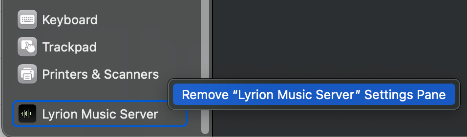

# Uninstalling the legacy Mac Settings Pane Item

Once you have migrated to Lyrion Music Server 9 or later on your Apple Mac computer, you'll realize it's now a Menu Bar item. You can therefore easily remove the legacy Settings Pane using a right click right there in the System Settings:

<figure markdown="span">
    {width="478"}
</figure>

Don't worry: all your preferences and the library cache will survive and stay in place to be used with your latest Lyrion Music Server.

