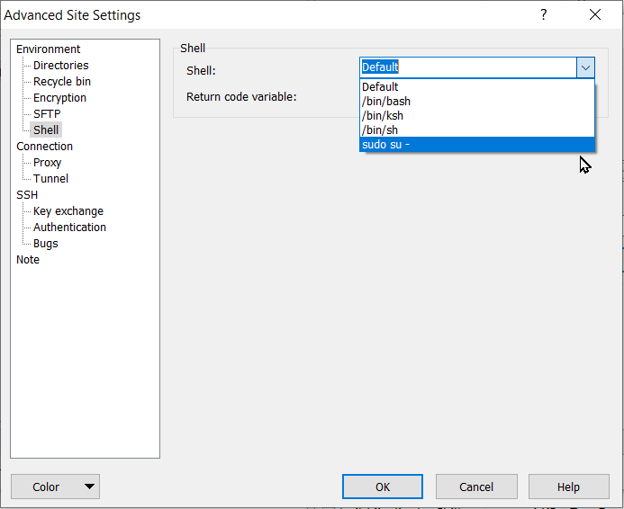
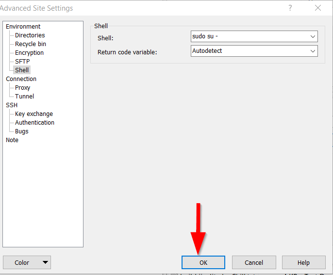
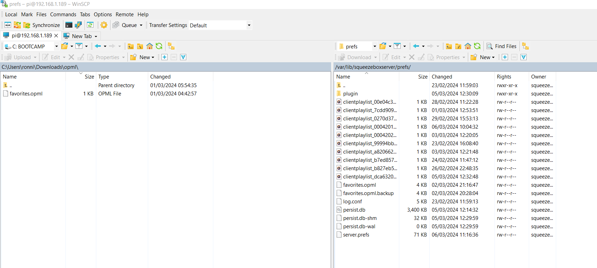

# How to use WinSCP as user `root`

## Introduction

For an introduction to using WinSCP with an example see "[WinSCP How To](winscp.md)".

## Instructions

Normally I use SFTP or SCP as File Protocal but sometimes one is denied permission to perform the task and one needs to utilise the user `root`.

* Stop LMS

* Fill in the login detail as required and then click on Advanced

* In the window that opens click on the following areas in sequence: "Shell"

* then "`sudo su`" from the dropdown

* then on OK

* The window will close and then click on Login

This is a rpi 4B with LMS installed on the RPiOS Bookworm Lite 64 bit:

