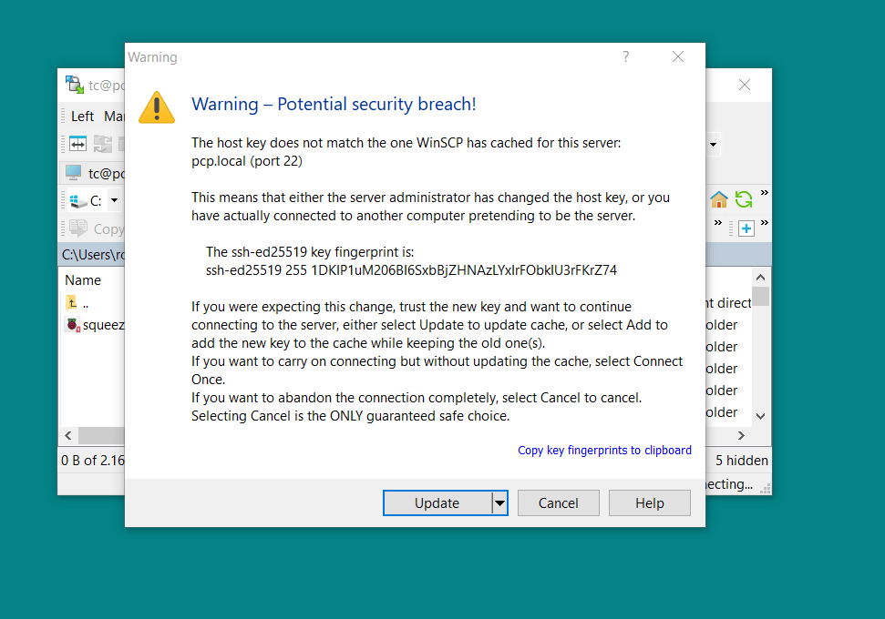
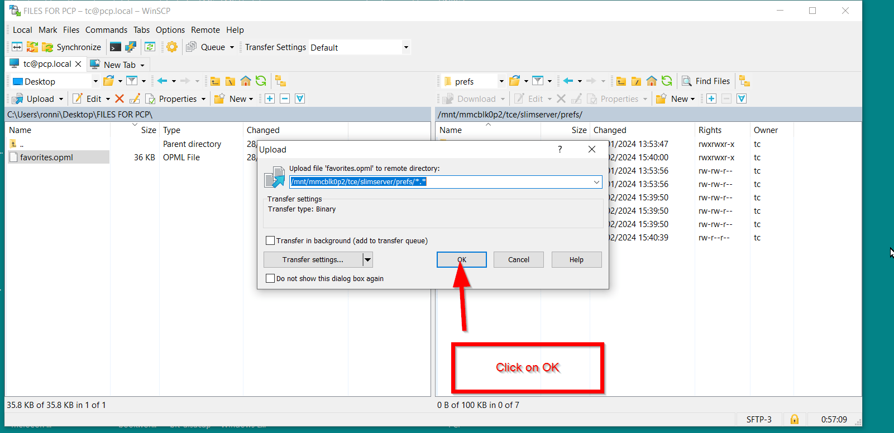
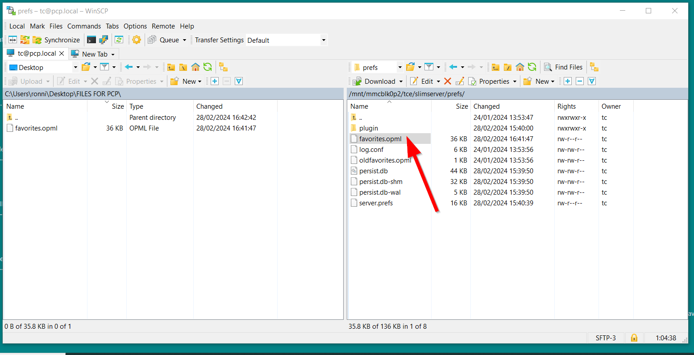
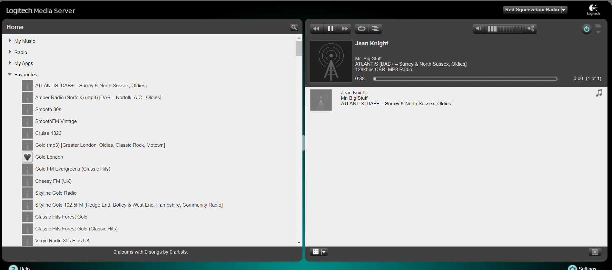

# How to transfer files using WinSCP

## Downlaod WinSCP

[Download the latest version of WinSCP](https://winscp.net/eng/download.php) and install according to their instructions.

## Transfer a file

This is the method to transfer a opml file but it demonstrates the general procedure to transfer any file or folder e.g. music folders, if one does not use SMB.

* Both the Windows computer and the Raspberry Pi have to be on the same network.

* On the Windows computer make a new folder on the desktop (I called mine FILES FOR PCP) and paste the favourites.opml inside

I seem to remember that when one starts WinSCP for the first time one is given the option to start in two different modes; I can't remember the name but you want the one that gives two panes side by side.

* Stop LMS from running on the pCP LMS tab page

* I always right click on the shortcut and "Run as Administrator"

* Leave the File Profile at SFTP   (Note; this setting can be changed, but for pCP it seems to work without a problem)

* Then Log in to the Raspberry Pi, you need the IP address (or use pcp.local)

* Leave the port # at 22

* The user name which is, by default `tc`

* The user password by default is `piCore`

* Click on Login

* When the Warning Box appears click on Update

You are presented with two screens:

The one on the left is the Windows computer you are using and the one on the right the Raspberry Pi with pCP

* In the Left Pane, select the location from the dropdown and then double click on the rewuired folder to open it.

* In the right pane select `<root>` from the dropdown

* From the list that appears below, navigate to `/usr/local/slimserver/prefs`

And this is where we go; one can either overwrite or rename the existing `favourite.opml` to `oldfavourite.opml` (I choose the latter; right click on the folder and click on rename from the dropdown).

* Then in the left pane right click on the folder and choose upload from the dropdown.

* Then click on OK in the box that appears

The file is uploaded.

Close WinSCP (click yes on the Termination warning box) and reboot the Pi.

