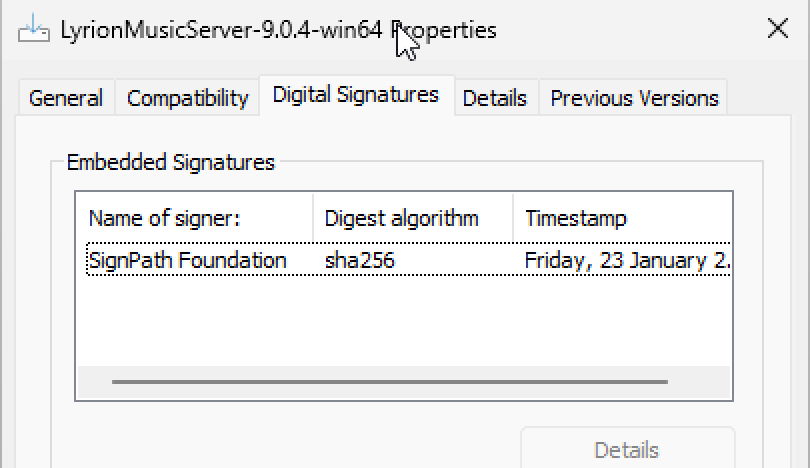

# Code Signing Policy

Free code signing for Windows is provided by [SignPath.io](https://about.signpath.io/), certificate by [SignPath Foundation](https://signpath.org/).

* Authors: [Github Committers](https://github.com/LMS-Community/slimserver/graphs/contributors)
* Reviewers: [michaelherger](https://github.com/michaelherger) (previously [mherger](https://github.com/mherger))
* Approvers: [michaelherger](https://github.com/michaelherger), [Paul Webster](https://forums.lyrion.org/member/105-paul-webster), [mikes](https://forums.lyrion.org/member/2427-mikes)

Windows may still show a warning at first. It might take some time before the download is known to be good.
You can check the downloaded file's signature details to verify authenticity by right clicking the file and checking the signagure tab.
The signer must be "[SignPath Foundation](https://signpath.org/)".

{ width=405 }